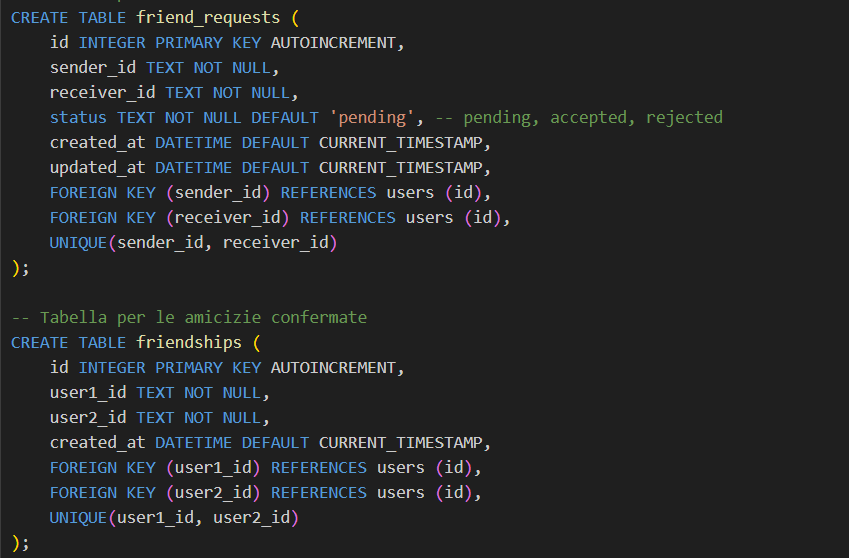
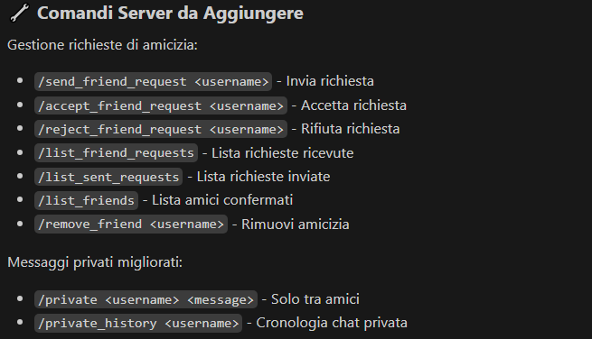
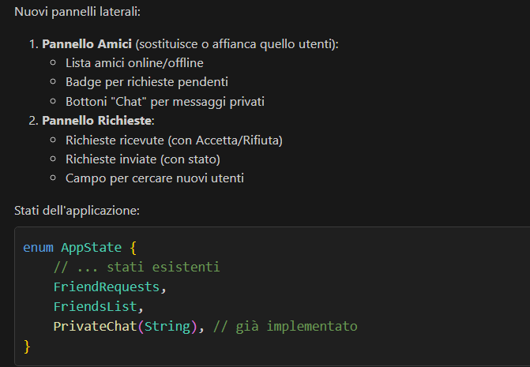

__TARGET__
WINDOWS --> @echo off
REM build.bat
echo Building for Windows...
cargo build --release

echo Binary size:
dir target\release\ruggine*.exe

LINUX --> #!/bin/bash
# build.sh
echo "Building for current platform..."
cargo build --release

echo "Cross-compiling for Windows (if on Linux)..."
cargo build --release --target x86_64-pc-windows-gnu

echo "Binary sizes:"
ls -lh target/release/ruggine*

__DEPENDENCIES__
tokio - runtime asincrono per networking
serde + serde_json - serializzazione messaggi
clap - parsing argomenti command line
log + env_logger - sistema di logging
crossterm - interfaccia utente terminale (client console)
eframe + egui - interfaccia grafica moderna (client GUI)
uuid - generazione ID univoci
chrono - gestione timestamp
sqlx - database SQLite per persistenza
sysinfo - monitoraggio CPU

__TESTS__
# Compila e avvia il server
cargo run --bin ruggine-server

# Client GUI (Interfaccia Grafica User-Friendly) - RACCOMANDATO
cargo run --bin ruggine-gui

# Client Mobile (Android/iOS) - NUOVO
cargo run --bin ruggine-mobile

# Client Console (per utenti tecnici)
cargo run --bin ruggine-client

# Oppure connessione diretta con telnet
telnet 127.0.0.1 5000

# Su Windows
telnet localhost 5000

/register alice
/users
/help
/quit

## 🎨 CLIENT GUI - INTERFACCIA MODERNA
Il client GUI (`ruggine-gui`) offre un'esperienza utente completa e moderna:

### ✨ Caratteristiche Principali
- 🖥️ **Cross-Platform**: Windows, Linux, macOS supportati nativamente
- 🎯 **User-Friendly**: Interfaccia intuitiva per utenti non tecnici
- 🌙 **Tema Dark/Light**: Modalità scura e chiara
- 📱 **Responsive**: Si adatta a diverse dimensioni dello schermo
- ⚡ **Real-Time**: Aggiornamenti in tempo reale senza lag

### 🔧 Funzionalità Complete
- 🔌 **Connessione Server**: Dialog di connessione semplificato
- 👤 **Gestione Account**: Registrazione e autenticazione utente
- 🏠 **Pannello Gruppi**: Creazione, join, leave gruppi con UI dedicata
- 👥 **Pannello Utenti**: Visualizzazione utenti online e inviti
- 💬 **Chat Real-Time**: Messaggi colorati con timestamp
- 📧 **Sistema Inviti**: Interfaccia drag-and-drop per inviti gruppo
- ⚙️ **Impostazioni**: Personalizzazione tema e comportamento
- ❓ **Aiuto Integrato**: Guida comandi e tips sempre disponibili

### 🎨 Elementi UI
- **Menu Bar**: Accesso rapido a tutte le funzioni
- **Sidebar Panels**: Gestione gruppi e utenti
- **Status Bar**: Stato connessione, utente corrente, gruppo attivo
- **Message Area**: Chat con scroll automatico e colori tematici
- **Input Area**: Invio messaggi con shortcuts da tastiera

### 🚀 Come Usare
1. Avvia il server: `cargo run --bin ruggine-server`
2. Avvia il client GUI: `cargo run --bin ruggine-gui`
3. Inserisci server (default: 127.0.0.1:5000) e connetti
4. Registra un username
5. Crea/unisciti a gruppi tramite i pannelli laterali
6. Inizia a chattare!

__TRACCIA__
Realizzare un’applicazione in RUST, dal titolo Ruggine, di tipo client/server per gestire una chat di scambio di messaggi testuali. La chat deve prevedere la possibilità di creare gruppi di utenti per la condivisione di messaggi. L’ammissione alla Chat è effettuata al primo avvio del programma, inviando al server una richiesta di iscrizione, mentre l’ingresso in un gruppo avviene solo su invito. Il programma deve girare su almeno 2 tra le diverse piattaforme disponibili (Windows, Linux, MacOS, Android, ChromeOS, iOS). Si richiede di porre attenzione alle prestazioni del sistema in termini di consumo di tempo di CPU e di dimensione dell’applicativo. L’applicazione deve generare un file di log, riportando i dettagli sull’utilizzo di CPU ogni 2 minuti. Si richiede inoltre di riportare nel report descrittivo del progetto la dimensione del file eseguibile.

//TODO 
Gestire bene last_seen
input area non c'è
fare login
trigger per messaggi effimeri
richieste di amicizia

