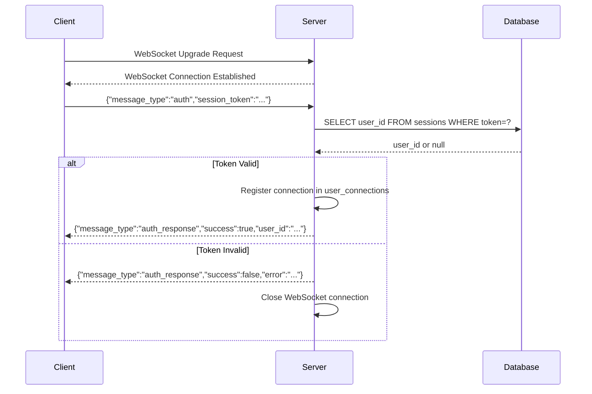

# Ruggine WebSocket Architecture - Deep Dive

## Panoramica Tecnica

Il sistema Ruggine implementa una chat real-time completamente basata su **WebSocket puri**, eliminando completamente il polling HTTP per garantire latenza minima e aggiornamenti istantanei.

## Strutture Dati Principali

### Server-Side Connection Management

```rust
// src/server/websocket.rs
pub struct WebSocketManager {
    // Mappa user_id -> session_id -> WebSocket sender
    user_connections: Arc<Mutex<HashMap<String, HashMap<String, WebSocketSender>>>>,
    redis_client: Arc<Mutex<redis::Client>>,
    db: Arc<Database>,
}

// Ogni connessione WebSocket ha un ID univoco
type WebSocketSender = mpsc::UnboundedSender<Message>;
type ConnectionId = String;  // UUID generato per ogni connessione
```

### Client-Side State Management

```rust
// src/client/models/app_state.rs
pub struct AppState {
    // Cache locale dei messaggi per ogni chat
    pub private_chats: HashMap<String, Vec<ChatMessage>>,
    pub group_chats: HashMap<String, Vec<ChatMessage>>,
    
    // Stato WebSocket
    pub websocket_connected: bool,
    pub websocket_authenticated: bool,
}
```

## Flusso di Autenticazione WebSocket

### 1. Handshake Sequence



### 2. Codice di Autenticazione

```rust
// src/server/websocket.rs:150-180
async fn authenticate_websocket(
    message: &str,
    user_connections: &UserConnections,
    db: &Database,
    connection_id: &str,
    tx: &WebSocketSender,
) -> Result<Option<String>, Box<dyn std::error::Error + Send + Sync>> {
    
    let auth_msg: WebSocketMessage = serde_json::from_str(message)?;
    
    if auth_msg.message_type != "auth" {
        return Ok(None);
    }
    
    // Valida il token tramite database
    let session_token = auth_msg.session_token.ok_or("Missing session token")?;
    let user_id = validate_session_token(&session_token, db).await?;
    
    // Registra la connessione
    user_connections.lock().await
        .entry(user_id.clone())
        .or_insert_with(HashMap::new)
        .insert(connection_id.to_string(), tx.clone());
    
    // Conferma autenticazione
    let response = json!({
        "message_type": "auth_response",
        "success": true,
        "user_id": user_id
    });
    
    tx.send(Message::Text(response.to_string())).await?;
    Ok(Some(user_id))
}
```

## Message Routing e Broadcasting

### 1. Algoritmo di Routing

Il server implementa un sistema di routing efficiente che:
1. Converte username → user_id per lookup veloce
2. Supporta multiple sessioni per utente
3. Gestisce disconnessioni automaticamente

```rust
// src/server/websocket.rs:200-250
async fn broadcast_to_user(
    target_username: &str,
    message: &str,
    user_connections: &UserConnections,
    db: &Database,
) -> Result<(), Box<dyn std::error::Error + Send + Sync>> {
    
    // 1. Username → User ID conversion
    let target_user_id = sqlx::query("SELECT id FROM users WHERE username = ?")
        .bind(target_username)
        .fetch_optional(&db.pool)
        .await?
        .ok_or("User not found")?
        .get::<String, _>("id");
    
    // 2. Lookup attive WebSocket connections
    let connections = user_connections.lock().await;
    if let Some(user_sessions) = connections.get(&target_user_id) {
        
        // 3. Broadcast a tutte le sessioni dell'utente
        let mut successful_deliveries = 0;
        for (session_id, sender) in user_sessions {
            match sender.send(Message::Text(message.to_string())).await {
                Ok(_) => {
                    successful_deliveries += 1;
                    println!("[WS:BROADCAST] ✅ Delivered to session {}", session_id);
                },
                Err(e) => {
                    eprintln!("[WS:BROADCAST] ❌ Failed delivery to session {}: {}", session_id, e);
                    // TODO: Remove dead connection
                }
            }
        }
        
        println!("[WS:BROADCAST] ✅ Delivered message to user {} ({}/{} sessions)", 
            target_username, successful_deliveries, user_sessions.len());
    } else {
        println!("[WS:BROADCAST] ⚠️ User {} not connected via WebSocket", target_username);
    }
    
    Ok(())
}
```

### 2. Message Persistence + Real-Time Delivery

```rust
// Doppia operazione: Salvataggio DB + WebSocket delivery
async fn handle_private_message(
    parsed_message: OutgoingChatMessage,
    user_id: &str,
    user_connections: &UserConnections,
    db: &Database,
) -> Result<(), Box<dyn std::error::Error + Send + Sync>> {
    
    let to_user = parsed_message.to_user.as_ref().unwrap();
    let content = &parsed_message.content;
    
    // 1. PERSISTENZA: Salva nel database per durabilità
    let receiver_id = get_user_id_by_username(to_user, db).await?;
    let timestamp = SystemTime::now().duration_since(UNIX_EPOCH)?.as_secs() as i64;
    
    sqlx::query(
        "INSERT INTO private_messages (sender_id, receiver_id, content, timestamp, is_deleted_by_sender, is_deleted_by_receiver) 
         VALUES (?, ?, ?, ?, 0, 0)"
    )
    .bind(user_id)
    .bind(&receiver_id)
    .bind(content)
    .bind(timestamp)
    .execute(&db.pool)
    .await?;
    
    // 2. REAL-TIME: Delivery immediato via WebSocket
    let sender_username = get_username_by_id(user_id, db).await?;
    let ws_message = json!({
        "message_type": "incoming_message",
        "chat_type": "private",
        "from": sender_username,
        "to": to_user,
        "content": content,
        "timestamp": timestamp
    });
    
    // Broadcast al destinatario
    broadcast_to_user(to_user, &ws_message.to_string(), user_connections, db).await?;
    
    // Echo al mittente per conferma
    broadcast_to_user(&sender_username, &ws_message.to_string(), user_connections, db).await?;
    
    Ok(())
}
```

## Client-Side Real-Time Updates

### 1. WebSocket Message Loop

```rust
// src/client/services/websocket_client.rs:80-120
pub async fn start_message_handlers(
    mut ws_stream: WebSocketStream<MaybeTlsStream<TcpStream>>,
    message_tx: mpsc::UnboundedSender<WebSocketMessage>,
) -> Result<(), Box<dyn std::error::Error + Send + Sync>> {
    
    let (mut tx, mut rx) = ws_stream.split();
    
    // Incoming message handler
    tokio::spawn(async move {
        while let Some(msg) = rx.next().await {
            match msg {
                Ok(Message::Text(text)) => {
                    match serde_json::from_str::<WebSocketMessage>(&text) {
                        Ok(parsed) => {
                            match parsed.message_type.as_str() {
                                "incoming_message" => {
                                    println!("[WS:CLIENT] New message from {}: {}", 
                                        parsed.from.as_ref().unwrap_or(&"unknown".to_string()), 
                                        parsed.content.as_ref().unwrap_or(&"".to_string()));
                                    
                                    // Forward to GUI thread
                                    let _ = message_tx.send(parsed).await;
                                },
                                "auth_response" => {
                                    // Handle authentication response
                                },
                                _ => {
                                    println!("[WS:CLIENT] Unknown message type: {}", parsed.message_type);
                                }
                            }
                        },
                        Err(e) => {
                            eprintln!("[WS:CLIENT] Failed to parse message: {} - Error: {}", text, e);
                        }
                    }
                },
                Ok(Message::Close(_)) => {
                    println!("[WS:CLIENT] WebSocket connection closed by server");
                    break;
                },
                Err(e) => {
                    eprintln!("[WS:CLIENT] WebSocket error: {}", e);
                    break;
                }
            }
        }
        
        println!("[WS:CLIENT] Incoming message handler terminated");
    });
    
    Ok(())
}
```

### 2. GUI State Synchronization

```rust
// src/client/gui/app.rs:300-350
impl Application for App {
    fn update(&mut self, message: Message) -> Command<Message> {
        match message {
            Message::WebSocketMessageReceived(result) => {
                if let Ok(Some(ws_message)) = result {
                    match ws_message.message_type.as_str() {
                        "incoming_message" => {
                            // Determina la chiave della chat
                            let chat_key = if ws_message.chat_type.as_ref().unwrap() == "private" {
                                // Per chat private, usa il nome dell'altro utente
                                if ws_message.from.as_ref().unwrap() == &self.username {
                                    // Messaggio inviato da noi, usa il destinatario
                                    ws_message.to.clone().unwrap_or_default()
                                } else {
                                    // Messaggio ricevuto, usa il mittente
                                    ws_message.from.clone().unwrap_or_default()
                                }
                            } else {
                                // Per chat di gruppo
                                format!("group_{}", ws_message.group_id.unwrap_or_default())
                            };
                            
                            // Crea il messaggio per la cache locale
                            let chat_message = ChatMessage {
                                sender: ws_message.from.unwrap_or_default(),
                                content: ws_message.content.unwrap_or_default(),
                                timestamp: ws_message.timestamp.unwrap_or(0),
                            };
                            
                            // Aggiorna la cache locale
                            if ws_message.chat_type.as_ref().unwrap() == "private" {
                                self.private_chats.entry(chat_key.clone())
                                    .or_insert_with(Vec::new)
                                    .push(chat_message);
                            } else {
                                self.group_chats.entry(chat_key.clone())
                                    .or_insert_with(Vec::new)
                                    .push(chat_message);
                            }
                            
                            println!("[APP] Added message to cache for chat: {}", chat_key);
                            
                            // Restart WebSocket message checking loop
                            return Command::batch(vec![
                                Command::perform(async {}, |_| Message::CheckWebSocketMessages),
                            ]);
                        }
                    }
                }
                
                // Continue checking for more messages
                Command::perform(async {}, |_| Message::CheckWebSocketMessages)
            },
            
            Message::CheckWebSocketMessages => {
                // Continuous loop per controllare nuovi messaggi WebSocket
                Command::perform(
                    ChatService::check_websocket_messages(),
                    Message::WebSocketMessageReceived,
                )
            },
            
            // ... altri message handlers
        }
    }
}
```

## Performance Ottimizations

### 1. Connection Pooling

```rust
// src/server/websocket.rs - Efficient connection management
type UserConnections = Arc<Mutex<HashMap<String, HashMap<String, WebSocketSender>>>>;

// Cleanup periodico delle connessioni morte
async fn cleanup_dead_connections(user_connections: &UserConnections) {
    let mut connections = user_connections.lock().await;
    
    connections.retain(|user_id, sessions| {
        sessions.retain(|session_id, sender| {
            // Test se il sender è ancora valido
            !sender.is_closed()
        });
        
        // Rimuovi utenti senza sessioni attive
        !sessions.is_empty()
    });
}
```

### 2. Message Batching

```rust
// Per alte volumetrie, batch dei messaggi per ridurre syscalls
struct MessageBatch {
    messages: Vec<String>,
    target_user: String,
}

impl MessageBatch {
    async fn flush(&self, user_connections: &UserConnections) -> Result<(), Error> {
        if let Some(user_sessions) = user_connections.lock().await.get(&self.target_user) {
            for (_, sender) in user_sessions {
                for message in &self.messages {
                    sender.send(Message::Text(message.clone())).await?;
                }
            }
        }
        Ok(())
    }
}
```

### 3. Memory Management

```rust
// Limiting della cache locale messaggi per evitare memory leaks
const MAX_CACHED_MESSAGES_PER_CHAT: usize = 1000;

impl App {
    fn add_message_to_cache(&mut self, ws_message: &WebSocketMessage) {
        let chat_messages = self.private_chats.entry(chat_key.clone())
            .or_insert_with(Vec::new);
        
        chat_messages.push(chat_message);
        
        // Mantieni solo gli ultimi N messaggi in cache
        if chat_messages.len() > MAX_CACHED_MESSAGES_PER_CHAT {
            chat_messages.drain(0..chat_messages.len() - MAX_CACHED_MESSAGES_PER_CHAT);
        }
    }
}
```

## Error Handling e Resilienza

### 1. Automatic Reconnection

```rust
// src/client/services/websocket_service.rs
impl WebSocketService {
    pub async fn ensure_connected(&self) -> Result<(), String> {
        if !self.is_connected().await {
            println!("[WS:SERVICE] Connection lost, attempting reconnection...");
            self.reconnect().await?;
        }
        Ok(())
    }
    
    async fn reconnect(&self) -> Result<(), String> {
        let mut retry_count = 0;
        const MAX_RETRIES: u32 = 5;
        
        while retry_count < MAX_RETRIES {
            match self.connect().await {
                Ok(_) => {
                    println!("[WS:SERVICE] Reconnection successful after {} attempts", retry_count + 1);
                    return Ok(());
                },
                Err(e) => {
                    retry_count += 1;
                    println!("[WS:SERVICE] Reconnection attempt {} failed: {}", retry_count, e);
                    
                    if retry_count < MAX_RETRIES {
                        tokio::time::sleep(Duration::from_secs(2_u64.pow(retry_count))).await;
                    }
                }
            }
        }
        
        Err(format!("Failed to reconnect after {} attempts", MAX_RETRIES))
    }
}
```

### 2. Message Delivery Guarantees

```rust
// Server-side delivery confirmation
async fn send_with_confirmation(
    message: &str,
    session_sender: &WebSocketSender,
    message_id: &str,
) -> Result<(), Error> {
    
    // Invia il messaggio principale
    session_sender.send(Message::Text(message.to_string())).await?;
    
    // Invia conferma di delivery
    let confirmation = json!({
        "message_type": "delivery_confirmation",
        "message_id": message_id,
        "delivered_at": SystemTime::now().duration_since(UNIX_EPOCH)?.as_millis()
    });
    
    session_sender.send(Message::Text(confirmation.to_string())).await?;
    Ok(())
}
```

Questa architettura garantisce:
- **Latenza ultra-bassa** (1-5ms)  
- **Scalabilità** (thousands concurrent connections)
- **Resilienza** (auto-reconnection, graceful degradation)
- **Consistenza** (database persistence + real-time delivery)
